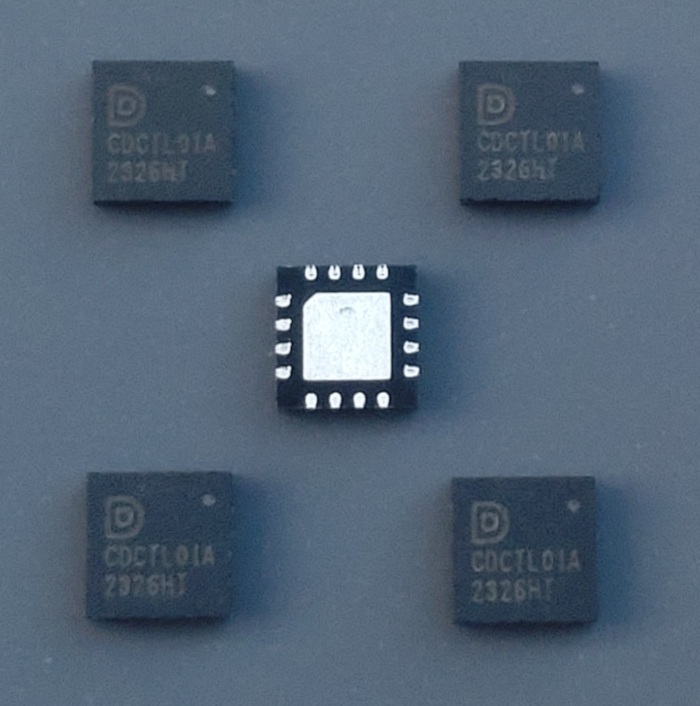
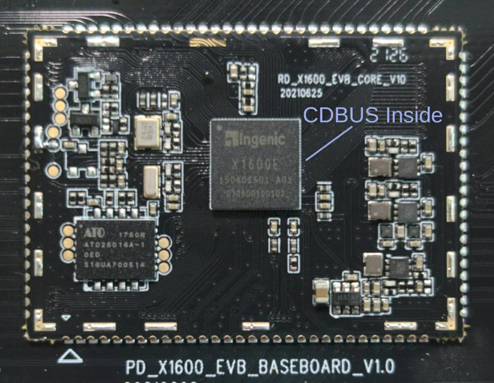

[[Chinese / 中文]](./intro_zh.md)

A New Generation of Fieldbus Integrating Simplicity, Versatility,  
High Performance, Reliability, Openness, and Low Cost

## Make UART / RS-485 Great Again

CDBUS is based on and compatible with the UART / RS-485 protocol and hardware, introducing mechanisms like hardware packetization and arbitration. This allows each node to freely send and receive data packets, breaking the traditional polling limitation of UART / RS-485 buses. The software layer can treat the half-duplex bus as if it were full-duplex.

The CDBUS controller, CDCTL01A, comes in a 3x3mm QFN package, supports communication rates up to 50 Mbps (50,000,000 bps), interfaces with the user's controller via SPI, and operates in a temperature range from -40°C to 125°C. It is simple to get started with.

 

Some MCUs / CPUs also come with built-in CDBUS controllers.

## Application Scenarios

 - Industrial automation, robotics, smart cities, automotive electronics, consumer electronics, modular toys, IoT, video transmission, etc.
 - For more complex applications, such as humanoid robots, traditional CAN and RS-485 performance is no longer sufficient,
   while industrial Ethernet protocols like EtherCAT are overly complex. CDBUS perfectly fills this gap.
 - For joint motor control in robotic arms, CDBUS allows direct debugging through the user communication interface.
   Waveform data and logs can be sent back to the base proactively without conflicting with user-issued commands.
   You can select and debug any one or multiple joints via software, even after the enclosure is assembled,
   without the need to add a USB debug port for each motor driver.
 - Many servo products do not support broadcast reply, preventing efficient host-side status retrieval of each servo on the bus.
   With CDBUS, all servos can reply to broadcast packets together, and the bus automatically handles scheduling to avoid conflicts.
   (The host side can use traditional hardware.)
 - Some devices using RS-232 are not convenient for bus connections, and communication speed and distance are limited.
   Why not switch to RS-485? Traditional RS-485 is half-duplex, which prevents slave devices from sending data proactively,
   making it quite inconvenient. However, CDBUS can overcome this limitation, potentially phasing out RS-232 over time.
 - For applications involving low-speed data acquisition, such as temperature monitoring or fire alarm systems,
   traditional RS-485 polling cycles can be very long. Switching to CDBUS with proactive reporting can significantly increase
   data collection efficiency and shorten alarm response times.

## Resource List

 - CDBUS Protocol and IP Core: https://cdbus.org
 - CDCTL01A Datasheet: https://dukelec.com/en/download.html
 - CDNET: https://github.com/dukelec/cdnet  
   CDNET Protocol and CDBUS / CDNET C Library
 - CDBUS-Bridge: https://github.com/dukelec/cdbus_bridge  
   USB to RS-485 (CDBUS) Converter
 - CDSTEP: https://github.com/dukelec/cdstep  
   Stepper Motor Controller
 - CDFOC: https://github.com/dukelec/cdfoc  
   FOC Motor Controller
 - CDCAM: https://github.com/dukelec/cdcam  
   RS-485 / CDBUS JPEG Camera
 - CDPNP: https://github.com/dukelec/cdpnp  
   Compact desktop semi-automatic SMT prototyping machine
 - CDBUS-GUI: https://github.com/dukelec/cdbus_gui  
   Serial / CDBUS / CDNET GUI Tool
 - PYCDNET: https://github.com/dukelec/pycdnet  
   CDBUS / CDNET Python Library
 - CDNET-TUN: https://github.com/dukelec/cdnet_tun  
   Virtual IP/UDP network interface for CDNET
 - More resources: https://github.com/dukelec?tab=repositories

