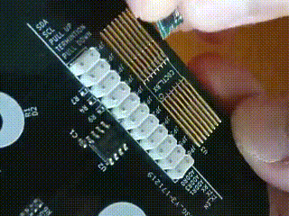
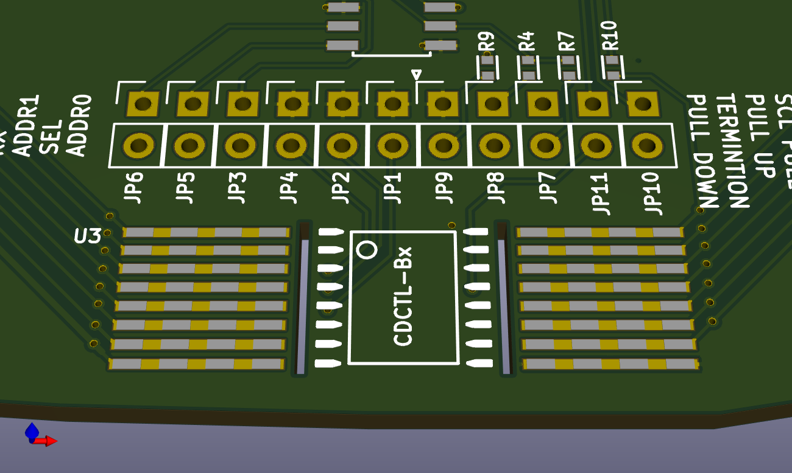
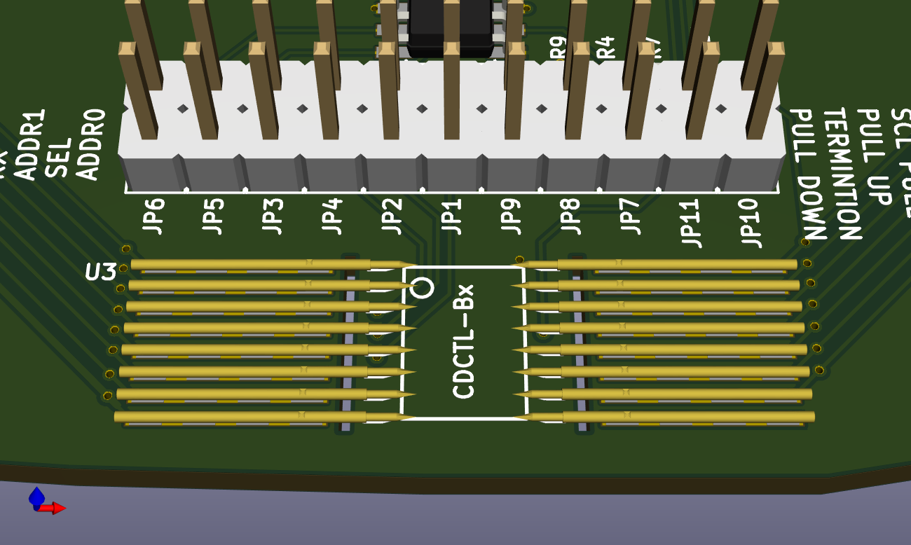
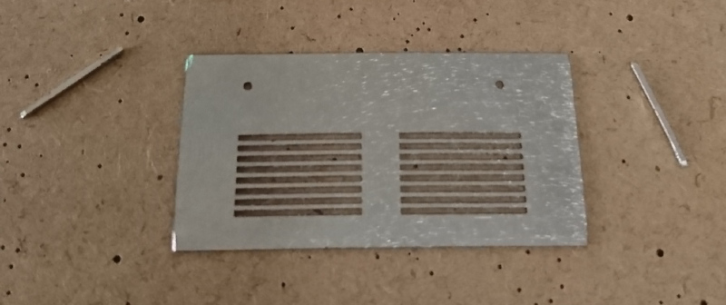
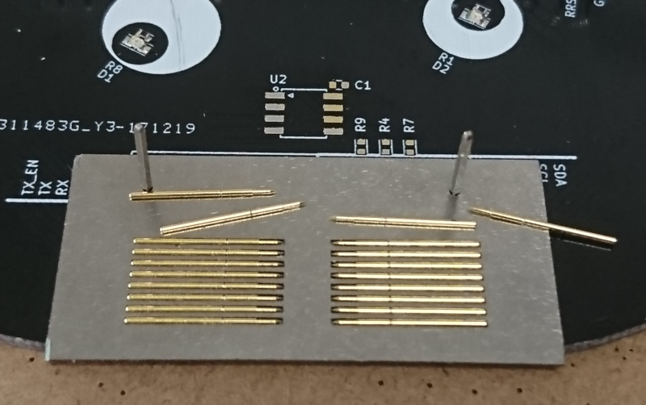

## CDBITE 模組連接方案 —— 免焊接、低成本、小體積

### 準備電路板

 - 首先確認兩側針尖的距離，由於放入模組時只會先頂入一側頂針，此時另外一側應留有少量空閒以便模組順利放入；
 - 爲防止焊料進入頂針內部，焊盤及針管兩端分別留有一定距離，針管頭部對應位置還要開槽防止虹吸發生；
 - 針管靠近頭部會有一個小凹槽，爲防止凹槽處斷裂，其兩側都需要焊接固定；
 - 錫膏過多會向上爬，影響美觀，所以焊盤寬度最好略小於針管直徑，同時錫膏開窗不要連續，應分多段以減少錫膏份量；

### 準備頂針固定治具

如果沒有治具，頂針的擺放會很費時，且焊接過程中頂針容易偏離原本位置，焊好之後不整齊。

最簡單的治具製作方法是使用電路板貼片常用的鋼網，鋼網厚度超過針尖高度即可（譬如 0.48 mm 直徑的針管其針尖高度爲 0.24 mm, 選擇 0.3 mm 厚度的鋼網即可）。

治具的外框與 PCB 繪製不同，通過細長條形狀開窗拼接而成（圖中使用的是矩形焊盤），接頭處留有一點距離，防止主體脫落，收到鋼網後通過小手磨切開銜接處便可以取下治具。

頂針的固定位置和定位孔同樣通過開窗形成。

治具的尺寸不要過大，避免妨礙其它貼片元器件。

鋼網打樣時務必要寫清楚用途，最好是親自確認最終生產文件。

### 製作流程

1. 先用常規鋼網刷錫膏；
2. 擺放頂針以外的其它貼片器件；
3. 先將定位柱插入治具，再一起找準位置放至 PCB 目標位置；
4. 將頂針依次放入固定治具；
5. 將整個電路板包含固定治具放入迴流焊爐，或手動使用熱風焊台焊接（通常看到針管側面有少量錫爬上來就代表焊接完成）；
6. 小心地取下固定治具，由於有助焊劑粘附，由角落向上扳動較爲容易取下。
7. 焊接剩餘插接件後便完成最終作品。

### 版權

歡迎使用及分享，但請保留此名稱：CDBITE.

