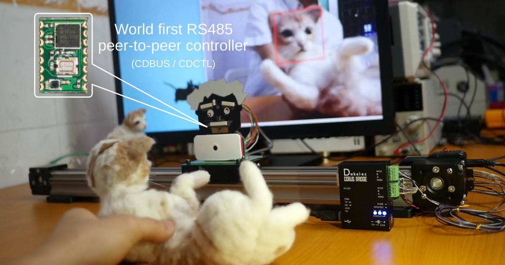

## 前言

當我們需要傳遞信息的時候就會涉及到通訊，通訊大致分爲兩類：有線通訊及無線通訊。
有線通訊譬如通過 U 盤拷貝文件、通過 HDMI 觀看影視；無線通訊譬如手機 WiFi 上網、腦電波心靈感應，
有沒有覺得後者明顯不夠穩定，沒錯，接下來介紹的通訊協議便是用於有線通訊，面向的是工業等對可靠性要求很高的場合，
如果你對相關領域不甚了解，可以想象一下通過它來替代網線上網，至少我經常通過它觀看 YouTube.

## CDBUS 串口總線協議 —— 簡單、通用、靈活、高效、安全、開放

### 簡單：
 - 最簡潔的協議，其運作方式一目瞭然；
 - 瑣碎工作由硬件接手，降低開發人員和 CPU 工作量，加快項目研發；
 - 搭配使用上層 CDNET 協議棧，可自動處理流控、完整性、大數據拆包等事務、還可組建多個網絡（CDNET 是一款適用 CDBUS 的簡潔、實時、高效的上層協議）。

### 通用：
 - CDBUS 使用最通用的串口數據格式，可用於總線或普通串口通訊；
 - 使用標準的 RS485 接口芯片及電路（這是用的最多的場景，其它場景有單線串口總線等）；
 - 可與傳統 RS485 硬件互通；
 - 搭配 CDNET-TUN 工具，可以支持 IPv4/v6 等協議，方便 IoT 物聯網應用，無縫連接各類有線及無線網絡。

### 靈活：
 - 支持多主機、併發讀寫、廣播數據、主動上報等多種方式；
 - 支持熱插拔，譬如機械臂末端可自動更換工具。

### 高效：
 - 基礎款獨立控制器 CDCTL-Bx 支持 10Mbps 速率（控制器與 CPU 之間可通過 20MHz SPI 接口，利用 DMA 交換數據）；
 - 併發讀寫：主機連續下發指令至多個設備，然後連續接收回覆，避免了傳統 RS485 一來一回的延時被放大 N 倍於設備數量的問題；
 - 視頻傳輸、機械控制單路總線即可，告別複雜的走線困擾（推薦在攝像頭端做視覺處理，畫面僅供預覽以便傳輸更多路視頻）；
 - 高同步性，通過廣播可光速同步各節點運作（沒有 EtherCAT 的轉發延時以及避免了因其所引發的複雜的同步問題）。

### 安全：
 - 硬件收發數據，避免軟件 bug 導致總線故障；
 - 高實時性，保證優先級，工業控制的時候甚至可以借用其剩餘帶寬上網聽音樂看視頻；
 - 支持多主機，主機故障可無縫切換至備用主機，不耽誤生產，甚至是避免事故發生。

### 開放：
 - 最核心的 IP 核開源，用戶可直接在 FPGA 中免費使用；
 - 開源的調試工具、代碼庫、示例項目應有盡有。

## 示例場景

### 機器視覺

完整視頻：
 - https://youtu.be/coZ6igK4Z7g
 - http://v.youku.com/v_show/id_XMzUwNzc0NzcxMg==.html

Raspberry Pi 可同時輸出預覽畫面及控制數據，用戶可在電腦上監控識別過程，遇到問題的時候可以很方便的知道原因及調整參數，且斷開電腦也不會影響設備運作。

Raspberry Pi 上方的人頭板是 CDCTL-Bx 配套的免焊接轉接板，使用自創的 CDBITE 連接方式：通過頂針咬住模組。

該場景搭配 CDNET-TUN 組建標準局域網，這使得圖像傳輸無需編寫任何代碼，
而且對於控制滑台，通過標準 Socket 通訊編程即可，譬如使用 Python 編程，包含 import 語句在內僅需 4 行代碼即可控制其移動，而且還能確保數據一定準確送達。
另外 Raspberry Pi 還可隨時通過 PC 共享網絡訪問外網，更新軟件和遠程控制都不在話下。

然而對於實時性要求高的場合，無論是 PC 還是 MCU 都可以直接使用底層的 CDNET 協議棧，用起來也非常方便。

### 串口透傳

通過以下方式，可大大簡化設備的連接方式，支持任何協議且無需更改設備上位機軟件：

該場景同樣是基於 CDNET 協議，所以在串口透傳應用的同時，控制電機和訪問互聯網也不是問題。

也可以無需額外軟件，通過純硬件方式透傳：

## 產品列表
 - CDCTL-Bx 核心模組 (I2C/SPI 基礎版本)（另有空白模組可做他用）
 - CDCTL-Bx-Socket 人頭免焊轉接板
 - CDBUS-Bridge 盒子
 - 預訂：CDCTL-Hx (SPI 高速版本), CDCTL-Px (Mini-PCIe 接口)

## 資料鏈接
 - CDBUS 協議及 IP 核: https://github.com/dukelec/cdbus_ip
 - CDCTL-Bx Datasheet: http://dukelec.com/en/download.html
 - CDNET 協議及代碼庫: https://github.com/dukelec/cdnet
 - CDNET-TUN: https://github.com/dukelec/cdnet_tun
 - CDBUS-Bridge: https://github.com/dukelec/cdbus_bridge_fw
 - 更多資源: https://github.com/dukelec?tab=repositories

