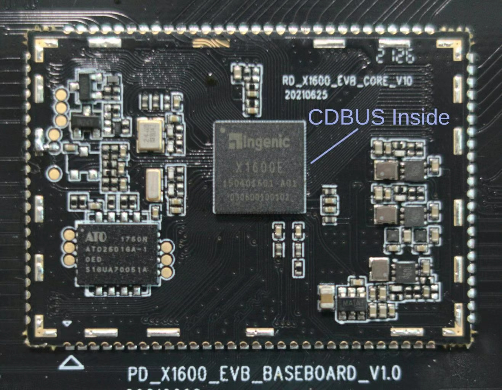

简单通用、高性能、高可靠性、开放 和 低成本 为一体的新一代现场总线

## Make UART / RS-485 Great Again

CDBUS 基于且兼容 UART / RS-485 协议和硬件，引入了 硬件分包 和 硬件仲裁 等机制，各节点可以自由收发数据包，
打破传统 UART / RS-485 总线只能轮询的限制。软件层可以把半双工总线当作全双工使用。

CDBUS 控制器 CDCTL01A 为 QFN 3x3mm 封装，通讯速率高达 50 Mbps (50000000 bps)，SPI 口接用户主控，工作温度范围 -40~125°C，上手简单。

 

另有一些 MCU / CPU 自带 CDBUS 控制器。

## 应用场景

 - 工业自动化、机器人、智慧城市、汽车电子、消费电子、模块化玩具、IoT 物联网、视频传输 …
 - 对于机器人等稍复杂的应用，特别是人型机器人，传统 CAN、RS-485 的性能已经不够用，而 EtherCAT 等工业以太网又太过繁杂。而 CDBUS 正好填补了这之间的空白。
 - 对于机械臂等关节电机驱动，使用 CDBUS 可以直接通过用户通讯接口进行调试，波形数据、调试打印可以上报到底座，
    不会和用户下发的命令冲突，可软件选择调试任意一个或多个关节，即便装配了外壳也丝毫不影响调试，完全没有必要为每个电机驱动增加一个 USB 调试口。
 - 舵机等产品，普遍不支持广播包回包，导致主机无法高效获取总线上各舵机的状态。使用 CDBUS 所有舵机可以一起回复广播包，总线会自动调度，避免冲突。（主机端可以使用传统硬件。）
 - 一些使用 RS-232 的设备，不方便总线连接，通讯速度和距离也受限，为何不改用 RS-485 通讯？
    因为传统 RS-485 是半双工，从机设备不能主动发送数据，十分不便。而使用 CDBUS 可以打破这种限制，让 RS-232 慢慢退出历史舞台。
 - 一些低速数据采集的应用，譬如 温度采集 和 消防系统，传统 RS-485 轮询一个周期时间很长，改用 CDBUS 主动上报可以大幅提升采集效率和缩短报警时间。

## 资源列表

 - CDBUS 协议及 IP 核: https://cdbus.org
 - CDCTL01A 芯片手册: https://dukelec.com/en/download.html
 - CDCTL01A 芯片 FAQ: https://github.com/dukelec/cdbus_doc/wiki/CDCTL01A-芯片-FAQ-中文版  
 - CDNET 协议及代码库: https://github.com/dukelec/cdnet
 - CDBUS-Bridge: https://github.com/dukelec/cdbus_bridge  
   USB 转 RS-485 (CDBUS)
 - CDSTEP: https://github.com/dukelec/cdstep  
   步进电机控制器
 - CDFOC: https://github.com/dukelec/cdfoc  
   FOC 无刷电机控制器
 - CDCAM: https://github.com/dukelec/cdcam  
   RS-485 / CDBUS JPEG 摄像头
 - CDPNP: https://github.com/dukelec/cdpnp  
   半自动桌面贴片机
 - CDBUS-GUI: https://github.com/dukelec/cdbus_gui  
   Serial / CDBUS / CDNET 图形界面上位机工具
 - PYCDNET: https://github.com/dukelec/pycdnet  
   CDBUS / CDNET Python 库
 - CDNET-TUN: https://github.com/dukelec/cdnet_tun  
   用于 CDNET 的 IP/UDP 虚拟网口
 - 更多资源: https://github.com/dukelec?tab=repositories

